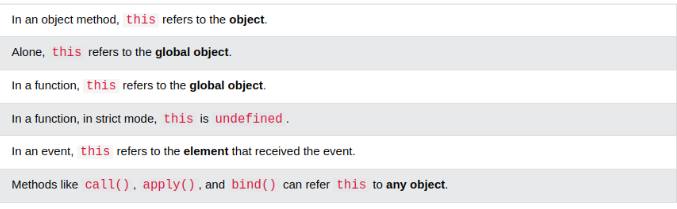

JavaScript variables are containers for data values 
The values are written as name:value pairs (name and value separated by a colon).

 
The name:values pairs in JavaScript objects are called properties:

 

# Accessing Object Properties
- objectName.propertyName
- objectName["propertyName"]

we can use function in object  
this refers to the object

 

**ths is not a var it is a keyword.**
 
Do Not Declare Strings, Numbers, and Booleans as Objects!
 
**When a JavaScript variable is declared with the keyword "new", the variable is created as an object**

