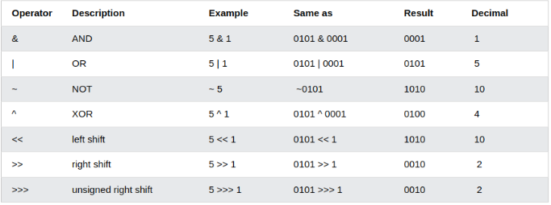

# learning js
1. JavaScript Can Change HTML Content
- JavaScript accepts both double and single quotes
```
<p id="demo">JavaScript can change HTML content.</p>

<button type="button" onclick="document.getElementById('demo').innerHTML = 'Hello JavaScript!'">Click Me!</button>
```

2. JavaScript Can Change HTML Attribute Values
```
<button onclick="document.getElementById('myImage').src='pic_bulbon.gif'">Turn on the light</button>


<button onclick="document.getElementById('myImage').src='pic_bulboff.gif'">Turn off the light</button>
```
3. JavaScript Can Change HTML Styles (CSS)
```
<p id="demo">JavaScript can change the style of an HTML element.</p>

<button type="button" onclick="document.getElementById('demo').style.fontSize='35px'">Click Me!</button>
```

4. JavaScript Can Hide HTML Elements
```
<p id="demo">JavaScript can hide HTML elements.</p>

<button type="button" onclick="document.getElementById('demo').style.display='none'">Click Me!</button>
```

5. JavaScript Can Show HTML Elements
```
<p id="demo" style="display:none">Hello JavaScript!</p>

<button type="button" onclick="document.getElementById('demo').style.display='block'">Click Me!</button>
```
# JavaScript Where To
> The <script> Tag <br>
In HTML, JavaScript code is inserted between <script> and </script> tags.

```
<p id="demo"></p>

<script>
document.getElementById("demo").innerHTML = "My First JavaScript";
</script>
```
# js function
A JavaScript function is a block of JavaScript code, that can be executed when "called" for.
<br>
**You can place any number of scripts in an HTML document.**
<br>
**Scripts can be placed in the <body>, or in the <head> section of an HTML page, or in both.**
1. JavaScript in <head>
> In this example, a JavaScript function is placed in the <head> section of an HTML page.

```
<html>
<head>
<script>
function myFunction() {
  document.getElementById("demo").innerHTML = "Paragraph changed.";
}
</script>
</head>
<body>
<h2>Demo JavaScript in Head</h2>

<p id="demo">A Paragraph</p>
<button type="button" onclick="myFunction()">Try it</button>

</body>
```
2. js in body
```
<p id="demo">A Paragraph</p>

<button type="button" onclick="myFunction()">Try it</button>

<script>
function myFunction() {
  document.getElementById("demo").innerHTML = "Paragraph changed.";
}
</script>
```
3. External JavaScript Advantages
- It separates HTML and code
- It makes HTML and JavaScript easier to read and maintain
- Cached JavaScript files can speed up page loads


- An external script can be referenced in 3 different ways:

  - With a full URL (a full web address)
    - ex: ```<script src="https://www.w3schools.com/js/myScript.js"></script>```
  - With a file path (like /js/)
    - ex: ``` <script src="/js/myScript.js"></script>```
  - Without any path
    - ex: ``` <script src="myScript.js"></script>```

-----------------------------------------------------------------------------------------
# js output
JavaScript can "display" data in different ways:

- Writing into an HTML element, using innerHTML.
<br>
  - **js use the document.getElementById(id)<br>
  - id =>html element innerHTML =>html content**
- Writing into the HTML output using document.write().
  - **Never call document.write after the document has finished loading. It will overwrite the whole document.**<br>
  - **Using document.write() after an HTML document is loaded, will delete all existing HTML**
- Writing into an alert box, using window.alert().
  - **alert your code**
  - **You can skip the window keyword.**
  - **window object is the global scope object**


- Writing into the browser console, using console.log().
  - For debugging purposes, you can call the console.log() method in the browser to display data.

---------------------------------------------------------------------------------------------
# js print
1. JavaScript does not have any print object or print methods.
2. The only exception is that you can call the window.print() method in the browser to print the content of the current window.
---------------------------------------------------------------------------------------------
computer program=>list of instruction <br>
programming instruction=>statements<br>
javascript=>list of programming statement<br>
**In HTML, JavaScript programs are executed by the web browser.**
---------------------------------------------------------------------------------------------
JavaScript's statements are composed of:

1. values
2. operators
3. expressions
4. keywords
5. comments
---------------------------------------------------------------------------------------------
very important point:<br>
1. **The statements are executed, one by one, in the same order as they are written.**
2. **Semicolons separate JavaScript statements.**
3. **JavaScript ignores multiple spaces.**
4. **For best readability, programmers often like to avoid code lines longer than 80 characters.**
5. JavaScript's statements can be grouped together in code blocks, inside curly brackets {...}.

``` 
function myFunction() {
  document.getElementById("demo1").innerHTML = "Hello Dolly!";
  document.getElementById("demo2").innerHTML = "How are you?";
}
```

JavaScript's statements often start with a keyword to identify the JavaScript action to be performed.
> var,let,const,if,switch,for,function,return,try

---------------------------------------------------------------------------------------------
# js syntax
- Fixed values are called Literals.<br>
  - Numbers are written with or without decimals
  - Strings are text, written within double or single quotes
- Variable values are called Variables.

** <br>
JavaScript uses the keyword's var, let and const to declare variables.=>use equal sign
<br>
<br>
<br>
what is evaluation?<br>
 - computation<br>
  what is computation?<br>
   - an expression<br>
   what is expression?<br>
     - combination of values, variable and operators** 
   <br>

یک عبارت ترکیبی از مقادیر، متغیرها و عملگرها است که به یک مقدار محاسبه می شود.

-------------------------------------------------------------------------------

# js comment
// or /* */<br>
It is most common to use single line comments.<br>
Block comments are often used for formal documentation.
<br>
Using Comments to Prevent Execution

-------------------------------------------------------------------------------

# js identifiers/name
A JavaScript name must begin with:

- A letter (A-Z or a-z)
- A dollar sign ($)
- Or an underscore (_)<br>
  Numbers are not allowed as the first character in names.
JavaScript is Case Sensitive
- 
All JavaScript variables must be identified with unique names(identifier)

<br>
JavaScript identifiers are case-sensitive.

-------------------------------------------------------------------------------
# js var
4 Ways to Declare a JavaScript Variable:
1. var =>The var keyword is used in all JavaScript code from 1995 to 2015.
2. let=>after 2015
3. const=>after 2015
4. using nothing

**always use const=>If you think the value of the variable can change, use let.<br>
Variables are containers for storing values.<br>
5. You can declare many variables in one statement.
``` 
let person = "John Doe", carName = "Volvo", price = 200;
 ```

-------------------------------------------------------------------------------
# VIP
In JavaScript, the equal sign (=) is an "assignment" operator, not an "equal to" operator.
The "equal to" operator is written like == in JavaScript.<br>
A variable declared without a value will have the value undefined.

**You cannot re-declare a variable declared with let or const.**<br>
**If you re-declare a JavaScript variable declared with var, it will not lose its value.**<br>
اگر میخوای دوباره از متغییری استفاده کنی که قبلا مقدار دادی بهش باید از
<br>
var
<br>
استفاده کنی
<br>

 این نکتع خیلی مهمه که بدونی اگر میخوای چند تا رشته رو کانکت کنی از + استفاده میکنی ولی تو جی اس میتونی رشته هم با عدد کانکت کنی

علامت دلار و ـ هم اسم متغیر میتونه باشه
-------------------------------------------------------------------------------


If you add a number and a string, the result will be a string!


-------------------------------------------------------------------------------
- ===	equal value and equal type
- !==	not equal value or not equal type
- ?	ternary operator
- %=	x %= y	x = x % y
- ++	Increment
- --	Decrement
- &&	logical and
- ||	logical or
- !	logical not
- typeof	Returns the type of variable
- instanceof	Returns true if an object is an instance of an object type


