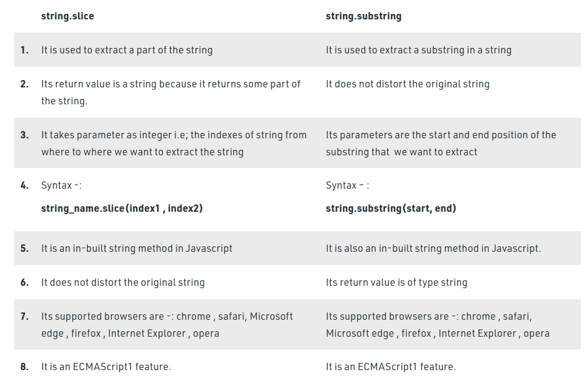

# js string
JavaScript strings are for storing and manipulating text.

<br>
To find the length of a string, use the built-in length property
<br>

The backslash (\) escape character turns special characters into string characters


<br>
Code    	Result<br>
\b	    Backspace<br>
\f  	Form Feed<br>
\n  	New Line<br>
\r  	Carriage Return<br>
\t	    Horizontal Tabulator<br>
\v	    Vertical Tabulator<br>

For best readability, programmers often like to avoid code lines longer than 80 characters.

<br>

so we have three ways:
1. after operator
2. within a text string
---
---
```
document.getElementById("demo").innerHTML = "Hello \
Dolly!";
```
---
3. A safer way to break up a string, is to use string addition:

---
```
document.getElementById("demo").innerHTML = "Hello " +
"Dolly!";
```
---
**we cannot break up a code line with a backslash**


###  strings can also be defined as objects with the keyword "new"
# Comparing two JavaScript objects always returns false.

There are 3 methods for extracting a part of a string:

- slice(start, end)
- substring(start, end)
- substr(start, length)

# replace

The replace() method does not change the string it is called on.
<br>
The replace() method returns a new string.
<br>
The replace() method replaces only the first match
<br>
If you want to replace all matches, use a regular expression with the /g flag set.
<br>
By default, the replace() method is case-sensitive

# diffrence between slice and substring  



